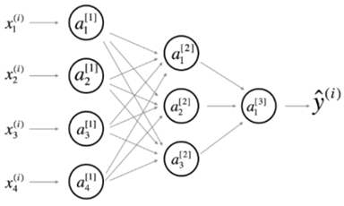
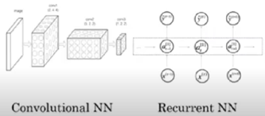
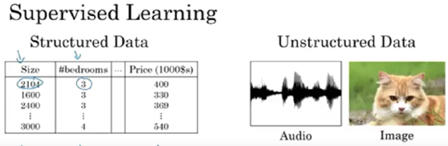
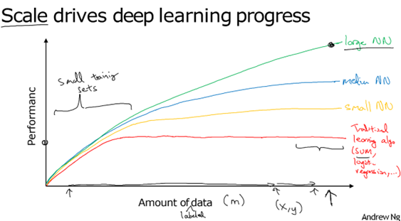

#NEURAL NETWORK
•	A neural network is a type of machine learning model inspired by the structure and function of the human brain. It consists of interconnected neurons (also called nodes) that are designed to recognize patterns and relationships in data.
It consists of three layers:
•	Input Layer – This layer takes the input X, which can consist of multiple parameters such as {x1, x2, x3, x4}.
•	Hidden Layer – Performs the computation on the input X using interconnected neurons and parameters and       applies weights, biases to learn patterns in the data. There can be multiple Hidden Layers.
•	Output Layer – Generates the final output Y based on the input and feature learned in hidden layer by neurons.

##Neural Network Types: 
1.  CNN:  Specialized for processing grid-like data (images)
2. RNN: Designed for processing sequential data (output dependent on previous ones)
3.  LSTM:  A type of RNN that can learn long-term dependencies.

#SUPERVISED LEARNING 
Supervised learning is a type of machine learning where the model is trained using labelled data. For every input X the correct output Y is provided so the model learns to map inputs to outputs. i.e. it learns from example (input, output) pair for future accurate prediction on unseen data.
 

 
•	We need a large amount of data to train a neural network effectively. More data helps the model learn better patterns, which leads to higher accuracy in outputs
