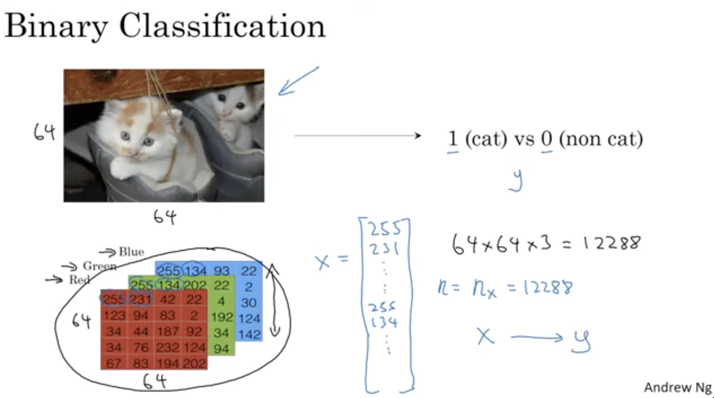
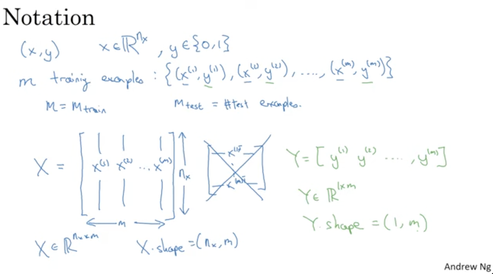
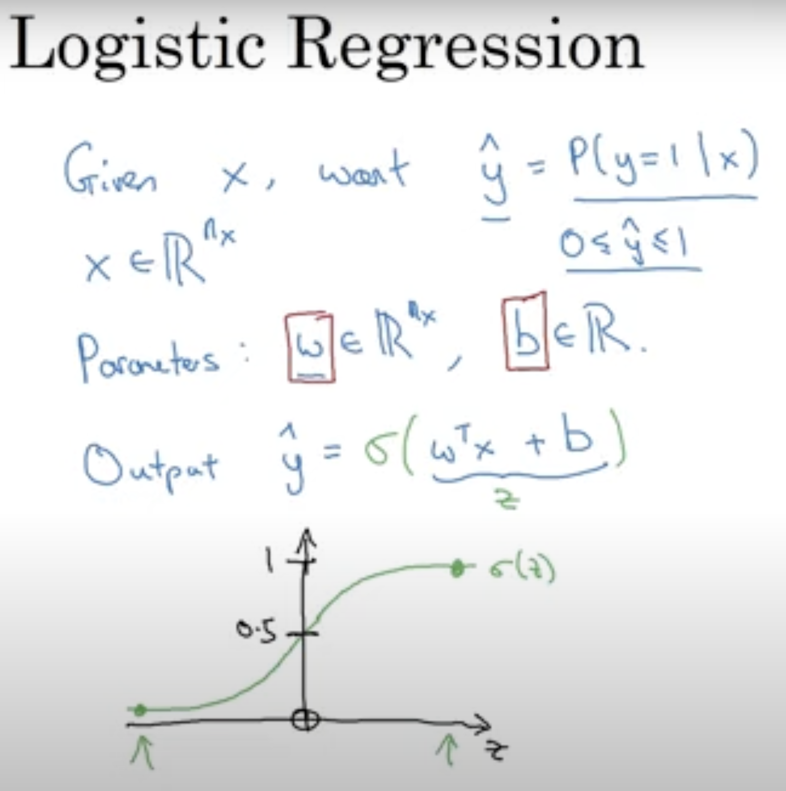
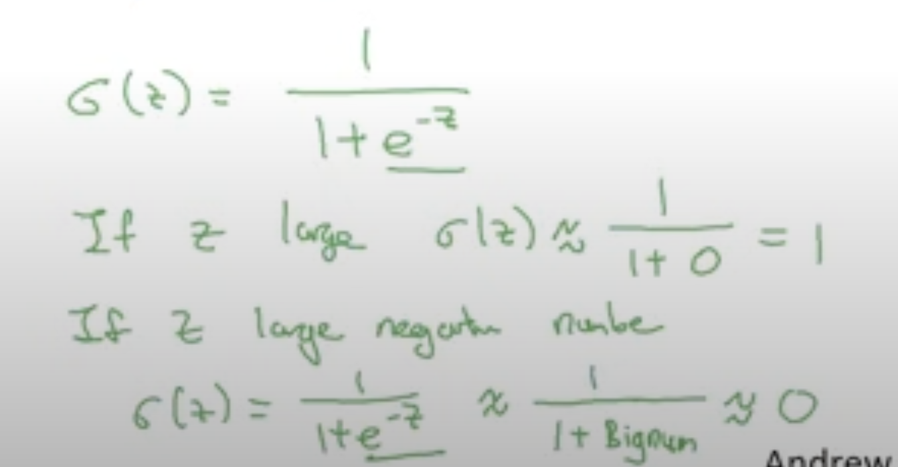
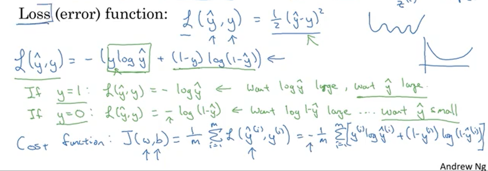
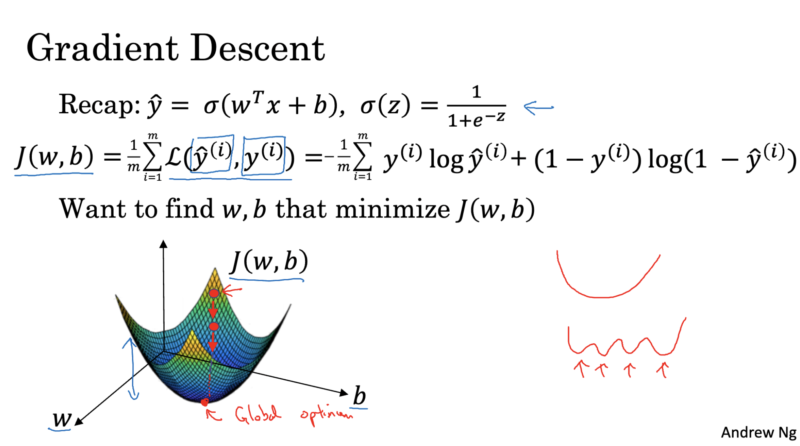
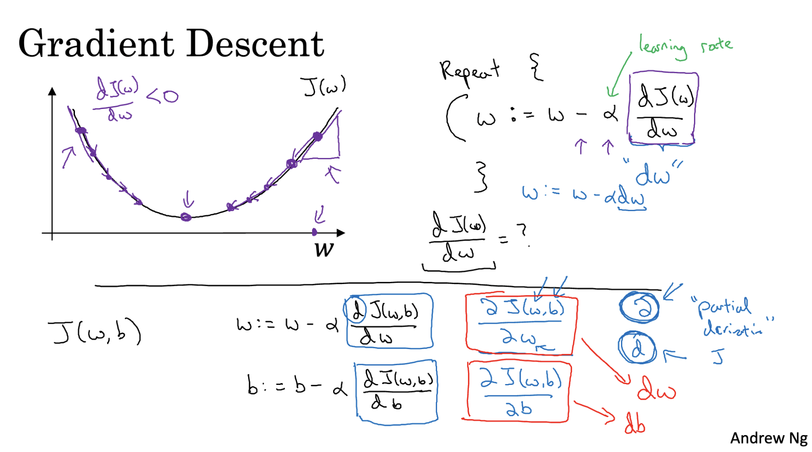

# Binary Classification
In a binary classification problem the result is a discrete value output.
For example, If the image is cat then(1) and if not a cat then(0) where the value of y is used to denote the output label of either 1 or 0.

---

# Image Representation
An image is represented in form of 3 RGB 64 Matrices. 
If input image is 64*64 pixels then we will have 3 corresponding RGB matrices of 64 pixels.
The dimension of feature vector x is denoted by nx and is equal to 12288.

---

# Notation for training examples
They are represented by (x,y) where x is the feature vector of dimesnion nx and y is binary output having values 0 and 1.

In similar manner m is used to denote the training examples and M can be put togehter to make test sets.

The feature vector in each training examples is put together as columns so they have m input feature vector from the training sets nd have nx number of rows.

`X ∈ ℝⁿˣ x m`: Is an input matrix where each column is an input feature vector with `nₓ` features, and there are `m` examples in total.  
`X.shape = (nₓ, m)`
`Y ∈ ℝ¹ × m`: Is a row vector containing all labels.  
`Y.shape = (1, m)`

---

# Logistic Regression
 It is a statistical method used for binary classification, which predicts one of two possible outcomes for a given input. It is done by modeling the probability that a given input belongs to a particular category.

Here:
- `ŷ` is the probability that the output label `y = 1`, given the input `x`.
- `x` is the input feature vector.
- **Sigmoid function** is used to bound the value between 0 to 1.
- Unlike linear regression, which predicts a continuous output, logistic regression predicts probabilities of the outcome that are bounded between 0 and 1. This is achieved using the logistic function (also known as the sigmoid function).
  

#### Parameters of Logistic Regression
- Weights (Coefficients): w is a vector assigned to each input feature.
- Bias (Intercept): b are the parameters for logistic regressions they are adjusted during the learning process to make predictions more accurate.

### Loss Function
The loss function used in logistic regression is called Log Loss or Binary Cross-Entropy Loss
A **loss function** measures how well a machine learning model’s prediction matches the actual target for a **single training example**.

It outputs a **scalar value** representing the error.

**Example:**  
For regression, a common loss function is **Mean Squared Error (MSE):**

For a single training example:
Loss = −[y∗log(p)+(1−y)∗log(1−p)]

Where:
- y = actual label (0 or 1)
- p = predicted probability (from sigmoid function)
If y = 1, the second term vanishes and it becomes -log(p) → penalizes low probability for correct class
If y = 0, the first term vanishes and it becomes -log(1 - p) → penalizes high probability for the wrong class

### Cost Function
- To train the parameters `w` and `b` we need a cost function. The cost function is used to determine how much error is presentor how close our output is to predicted output.
- For the entire training set we require the average of loss function which is the cost function.
- We need to adjust value of parameters `w` and `b` to minimize cost function `J(w,b)` using techniques like gradient descent.

---

# Gradient Descent
It is an optimization algorithm used to minimize a cost function by finding the direction of steepest descent.

