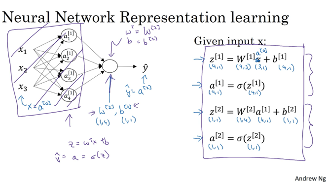

# Neural Network Representation

- A neural network consists of an **input layer** (takes data), **hidden layer(s)** (process data), and an **output layer** (generates prediction).
- The training set consists of input values `X` and output values `Y`, which are used to train the hidden layer parameters of the neural network.

---

# Computing Neural Network Outputs

Each node present in the hidden layer of a neural network performs two computations. And for this computation to be faster and easier, we use **vectorization**.

In a neural network, the output computation can be seen as **iterative applications of logistic regression** at each layer, including the output layer.

---

# Vectorizing Across Multiple Examples

