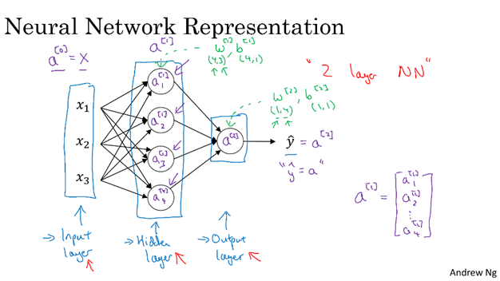
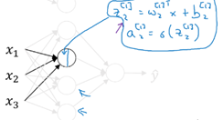
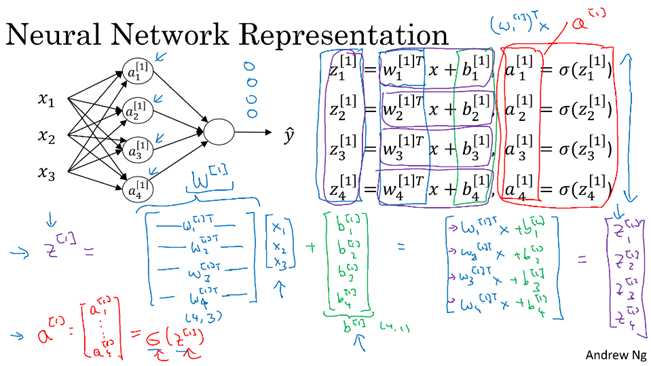
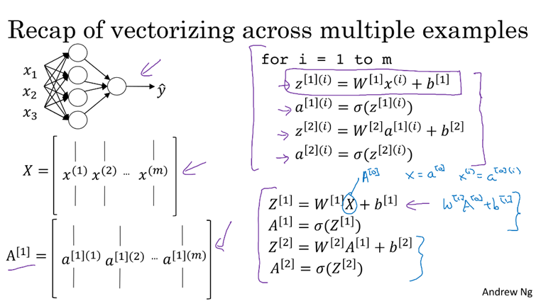

# Neural Network Representation

- A neural network consists of an **input layer** (takes data), **hidden layer(s)** (process data), and an **output layer** (generates prediction).
- The training set consists of input values `X` and output values `Y`, which are used to train the hidden layer parameters of the neural network.

---

# Computing Neural Network Outputs

Each node in the hidden layer of a neural network performs two main computations. 
•	First, it calculates the linear combination z using the input values along with the corresponding weights and biases. 
•	Second, it passes this z value through an activation function g() to produce the activated output a.
 To make these computations faster and more efficient, especially when dealing with large datasets and multiple nodes and layers, we use vectorization instead of using explicit for-loops. 

For a two-layer neural network (1 hidden layer + 1 output layer), forward propagation is done as follows:
 Hidden Layer (Layer 1):
Stack all weights into a matrix: W[1]
Stack all biases into a vector: b[1]
Compute:
o	Z[1] = W[1] · X + b[1]  (Linear combination)
o	A[1] = σ(Z[1]) (Activation using sigmoid or ReLU)
Output Layer (Layer 2):
Compute:
o	Z[2] = W[2] · A[1] + b[2]
o	A[2] = ŷ = σ(Z[2]) (Final prediction)

In a neural network, the output computation can be seen as **iterative applications of logistic regression** at each layer, including the output layer.

---

# Vectorizing Across Multiple Examples

# Activation Functions
