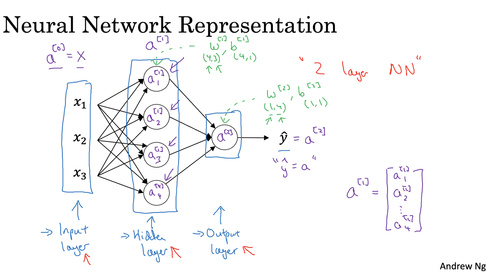
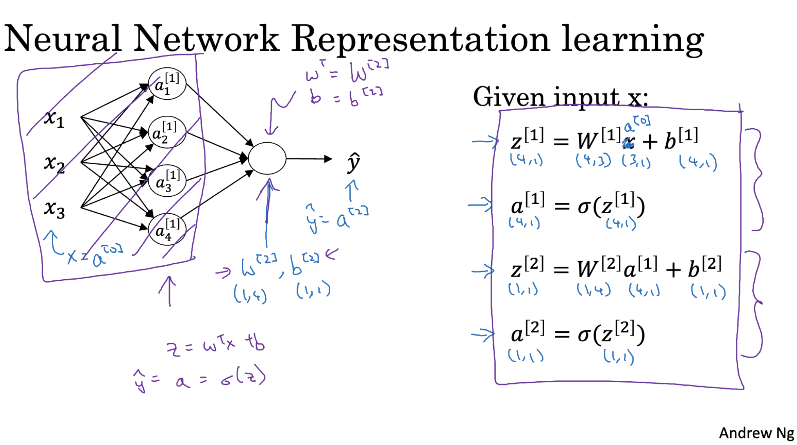

# Neural Network Representation
A neural network is structured in layers that help it learn complex relationships from input data. Here’s how each part plays a role:

- Input Layer: This is the first layer where the data enters the network. Each feature of the data has a corresponding input node.
- Hidden Layers: These intermediate layers carry out most of the learning. They apply mathematical operations (using weights and biases) and activation functions to transform the inputs. The more hidden layers a network has, the deeper it is.
- Output Layer: The final layer produces the network’s prediction. The structure and activation function used in this layer depend on the type of task—classification, regression, etc.

Each layer passes its output to the next layer, forming a network of information flow. These layers, combined with training using data, allow the neural network to learn how to make accurate predictions.

---

# Computing Neural Network Outputs
- Each neuron in a hidden layer carries out two main steps:
 - First, it computes a value z using the inputs from the previous layer, along with that neuron’s own weights and bias. This is a simple linear combination: z = wᵀx + b.
 - Then, this value z is passed through an activation function (like sigmoid or ReLU) to produce the output a for that neuron. This output then becomes input for the next layer of the network.
- Instead of handling each neuron one at a time using loops (which is inefficient), we apply vectorization. That means we handle entire layers at once by representing the weights, biases, inputs, and outputs as matrices. This allows us to compute all the z and a values for a layer in one shot using matrix operations, making the process much faster and cleaner.
- When dealing with multiple neurons in a layer, we stack their parameters and outputs vertically in a matrix form. This organized structure lets us scale up our neural network to handle large datasets more efficiently.

