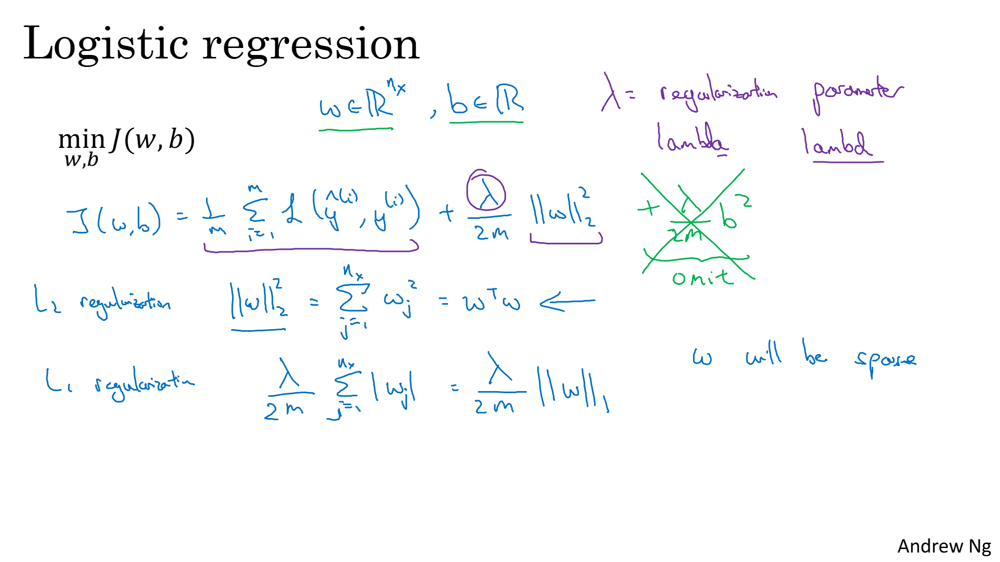
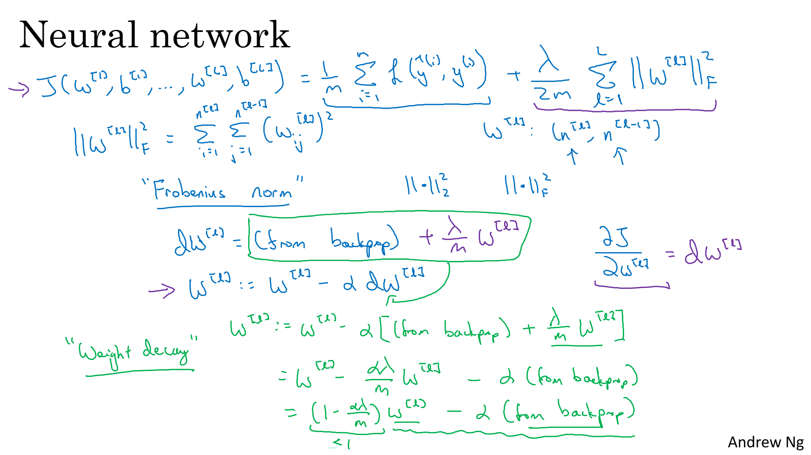
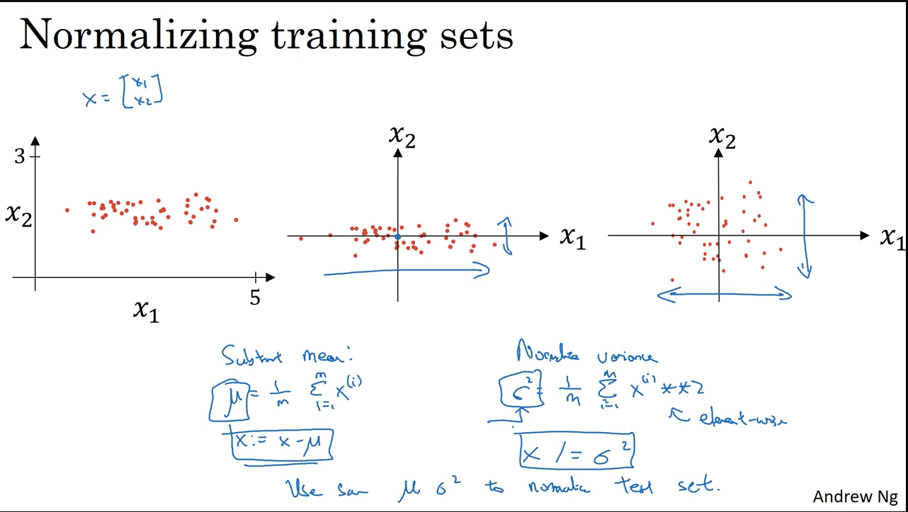
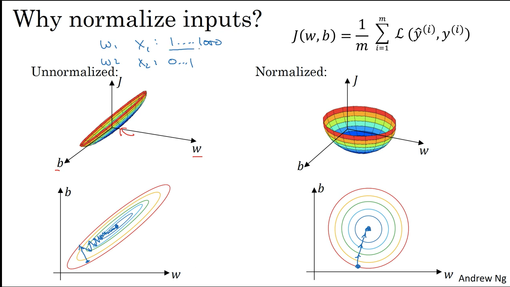

## Train/Dev/Test Sets

- **Training Set** – Used to train the model and learn its parameters.
- **Development (Dev) Set** – Used to tune hyperparameters and compare models.
- **Test Set** – Used for final unbiased evaluation of selected model.

### Dataset Splits

- **Small Datasets** – (70% Train / 30% Test) or (60% Train / 20% Dev / 20% Test)
- **Large Datasets** – (98% Train / 1% Dev / 1% Test)

> Dev and Test sets should come from the same distribution as the training data.  
> If no Test set is available, the Dev set can act as both Dev and Test, but this increases the risk of overfitting.

---

#### Bias and Variance

- **Variance**: Measures how much the model’s predictions change when trained on different subsets of the data.
- **Bias**: Refers to the error introduced when a model makes strong assumptions and oversimplifies the data.

---
#### Train Set and Dev Set Error

- **Train Set Error**: The error measured on the data that the model was trained on. It tells us how well the model has learned the training data. 
- **Dev Set Error**: The error measured on a development set not seen during training. It helps to evaluate the model's ability to generalize to unseen data.  

#### Error Diagnosis Table

| Training Error | Dev Set Error | Diagnosis                        | Train Set Error % | Dev Set Error % |
|----------------|----------------|----------------------------------|--------------------|------------------|
| High           | High           | High bias (underfitting)         | 15%                | 16%              |
| Low            | High           | High variance (overfitting)      | 1%                 | 11%              |
| High           | Higher         | High bias and high variance      | 15%                | 30%              |
| Low            | Low            | Low bias and low variance (ideal)| 0.5%               | 1%               |

---

#### Bias-Variance Trade-off

It is a balance between a **simple model** (high bias, low variance) and a **complex model** (low bias, high variance) to achieve the best performance on **unseen new data**.

---

### Solutions

#### High Bias (Underfitting)
- Increasing the model complexity by adding more layers or units
- Training model for more epochs/iteration

####  High Variance (Overfitting)
- Collect more training data
- Using regularization (L2, dropout)

## Regularization

Regularization is a technique used in machine learning to prevent overfitting by adding a penalty to the loss function.  
It is used to reduce overfitting (high variance), especially when getting more training data is difficult or expensive.  
It penalizes large weight parameters, and the penalty strength is controlled by the regularization parameter **λ**.

### L2 Regularization (Weight Decay)
- Adds **(λ / 2m) * ||w||²** to the cost function.
- Called "Weight Decay" because weights shrink slightly at each training step.
- Encourages smaller weights.
- Commonly used in neural networks.

### L1 Regularization
- Adds **(λ / m) * Σ |w[j]|** to the cost function.
- Less common in deep learning compared to L2.

## Regularization on Logistic Regression

## Regularization in Neural Network

## Other Regularization Methods

### Data Augmentation

Data augmentation artificially increases the size of the training dataset by applying transformations to existing data. This helps the model generalize better by exposing it to varied forms of the same input.

Common techniques include: **Horizontal flipping**,**Random rotations**,**Random cropping** etc.

> These techniques help reduce overfitting by creating new "fake" examples from existing data, without requiring new independent data.

### Early Stopping

Early stopping monitors the model's performance on a dev set during training. If the error starts increasing indicating overfitting, training is stopped early. This prevents the model from **memorizing** the training data ans saves training time and **improves generalization** to unseen data.

- Both of these techniques are simple yet powerful tools for building more robust neural networks, especially when data is limited.

## Normalization

Normalization ensures that all input features are on a similar scale, which significantly speeds up the training process and improves convergence.THis process is also called as feature scaling.

#### Steps in Normalization:

1. **Mean Subtraction**:  
   Subtract the **mean** \( \mu \) from each feature in the training set. This centers the data around zero (zero mean).

2. **Variance Scaling**:  
   Compute the **standard deviation** \( \sigma \) of each feature, then divide each feature by \( \sigma^2 \). This results in unit variance.

>  The same \( \mu \) and \( \sigma^2 \) from the training set must be used to normalize the dev and test sets.

---
#### Why Normalize?

- Without normalization:
  - Input features may be on very different scales.
  - This leads to an **elongated cost function**, which slows down and complicates gradient descent.

- With normalization:
  - Features are scaled similarly.
  - The **cost function becomes more symmetric and spherical**, helping gradient descent converge **faster and more reliably**.

  

> Normalization is especially important when using gradient-based optimization algorithms.

---
