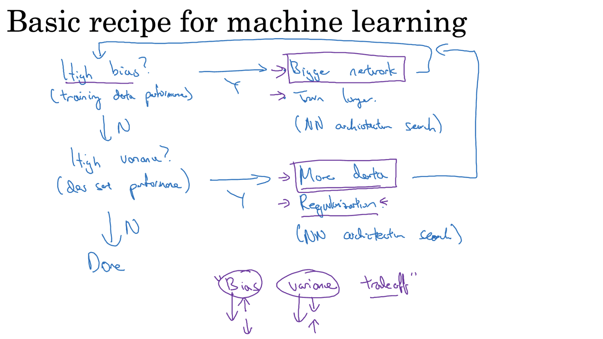
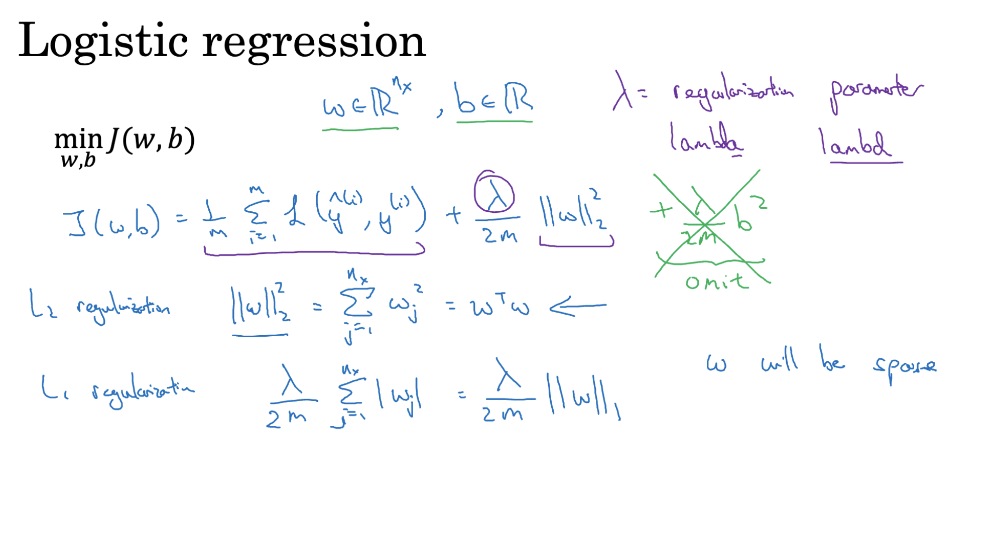
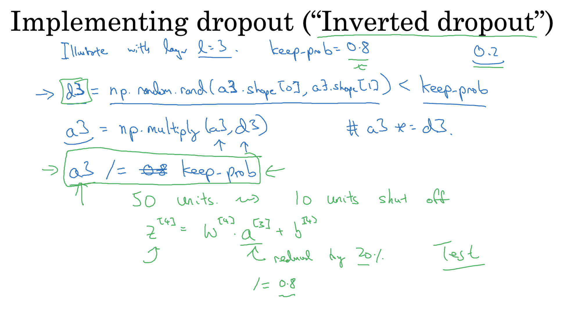

# Train/ Dev/ Test Sets

### Training Set
- Used to train the model.
- Model learns the parameters (weights and biases) from this data.

### Dev Set 
- Used to tune hyperparameters and select the best model.
- Helps evaluate how well the model generalizes to unseen data.

### Test Set
- Used only once after training and tuning.
- Evaluates the final performance of the model.

### Datasets Split Ratio
- The dataset is split into 98% training, 1% development , and 1% test set when we have large datasets.If we have a small dataset the general 60/20/20 split also works as well.
- It is important to make sure that the training set and the dev/test sets are all from the same distribution. For example - If the model is trained on high resolution images but the test set contains low resolution images the model will not work properly.
- It is ok in some cases to not have a test set and only a dev set.

---

# Bias and Variance

### Bias
- Error due to **over-simplified assumptions** in the model.
- High bias -> Model is too simple and misses relevant patterns (underfitting).
- Example: Predicting a curve with a straight line.

### Variance
- Error due to **model sensitivity to small fluctuations** in training data.
- High variance -> Model is too complex and fits noise in the training data (overfitting).
- Example: A very wiggly curve that perfectly fits training points but generalizes poorly.

### Bias-Variance Trade-off
| Scenario          | Bias      | Variance | Model Behavior             |
|-------------------|-----------|----------|----------------------------|
| Underfitting      | High      | Low      | Poor on train & dev        |
| Overfitting       | Low       | High     | Good on train, poor on dev |
| Just Right        | Low       | Low      | Good on train & dev        |

---

# Regularization

### What is Regularization?
- A technique used to **reduce overfitting** in machine learning models.
- It adds a **penalty term** to the loss function to discourage the model from learning overly complex patterns (i.e., large weights).

### Types of Regularization

#### L2 Regularization
- Adds the **sum of squares of weights** to the loss.
- **New Loss Function:** J(w, b) = original_loss + λ * Σ(w²)

- Keeps weights small, smooths the model.

#### L1 Regularization 
- Adds the **sum of absolute values of weights** to the loss.
- Can lead to sparse models (some weights become zero).

### Regularization Term

- **λ (lambda):** Regularization parameter.
- Controls the strength of the penalty.
- Higher λ → more regularization → simpler model.
- Too high λ → underfitting.
- Python Note: While using, λ is often written as lambd to avoid conflicts with Python's lambda.

### Effect of Regularization
| Model Behavior  | Regularization Strength  | Result               |
|-----------------|--------------------------|----------------------|
| Overfitting     | Increase λ               | Reduces variance     |
| Underfitting    | Decrease λ               | Reduces bias         |

### Why does Regularization help with overfitting?
- When a neural network learns not only the underlying patterns in the training data but also the noise, it performs well on training data but poorly on new data.
- Regularization adds a penalty to the cost function to keep the weights small. This helps the model avoid learning the noise and focus on the actual patterns.

### Intuition
- When the regularization strength (`lambda`) is **high**, it **discourages large weights**.
- This keeps the model simple, reducing its capacity to memorize the training data.
- As a result, the network is **less likely to overfit**.

### Cost Function Update
The original cost function is modified to include a regularization term: J(w, b) = (1/m) * Σ Loss(y, ŷ) + (λ / (2m)) * Σ ||W||²

### Impact on Network Behavior

- **Reduced Complexity:** The network becomes less sensitive to small fluctuations in training data.
- **Linear Approximation:** When weights are small, activation functions like `tanh` and `sigmoid` stay in their linear regions, making the network behave more like a linear model.
- **Less Overfitting:** The model learns general patterns instead of memorizing noise.

## Dropout Regularization in Neural Networks

Dropout is a popular regularization technique to prevent **overfitting** in deep neural networks.

### What is Dropout?

- During **training**, dropout randomly turns off a certain percentage of neurons in each layer.
- This means those neurons do **not** participate in the forward or backward pass for that iteration.
- During **testing**, all neurons are active, but their outputs are scaled accordingly.

1. Choose the Dropout Probability
- Define a hyperparameter called `keep_prob`.
- It represents the probability that a neuron is **kept active** during training.
- For example, `keep_prob = 0.8` means each neuron has an 80% chance of staying on.

2. Create a Dropout Mask
- For a layer’s activation matrix `A`, generate a random binary mask `D` of the same shape.
- Each element of `D` is:
  - `1` with probability `keep_prob`
  - `0` otherwise
- This mask determines which neurons are active in the current training step.

3. Apply the Dropout Mask
- Multiply the activation matrix element-wise with the mask: A_dropout = A * D

4. To ensure the overall activation magnitude remains stable, divide by keep_prob: A_scaled = A_dropout / keep_prob

## Other Regularization Methods

### Data Augmentation (for images)

- What it does: Increases dataset diversity artificially by flipping, rotating, scaling, etc.
- Effect: Helps the model generalize better to unseen data.
- Common in: CNNs and image-related models.

### Early Stopping:

- Monitoring the validation error during training and stopping when the error starts to increase, indicating overfitting.
- Prevents overfitting by stopping training before the model starts to memorize the training data.This ensures that it generalizes well to new, unseen data.
- Integrates the cost function with regularization, making the training process more complex.

