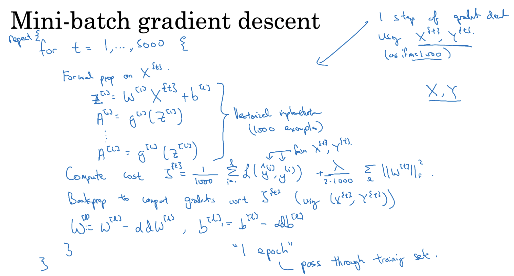
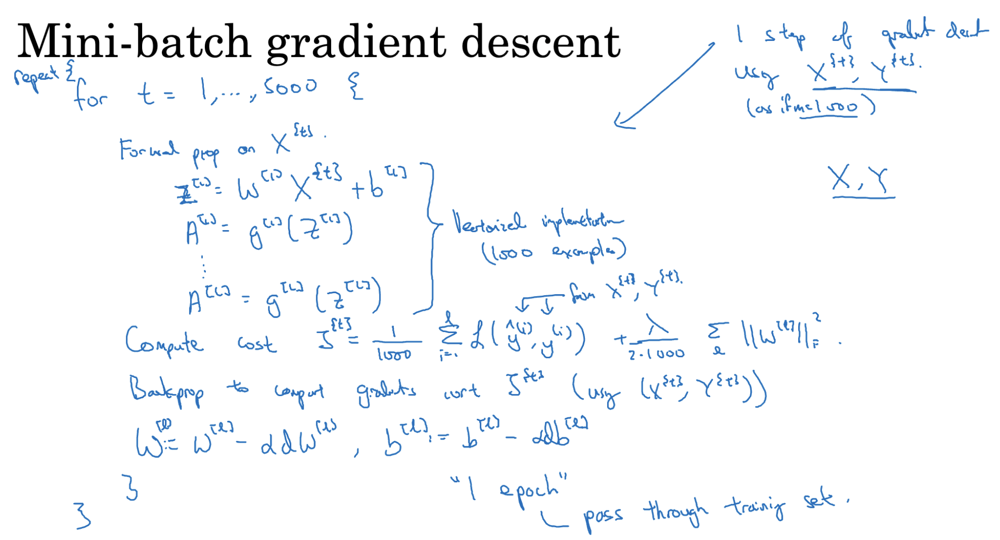
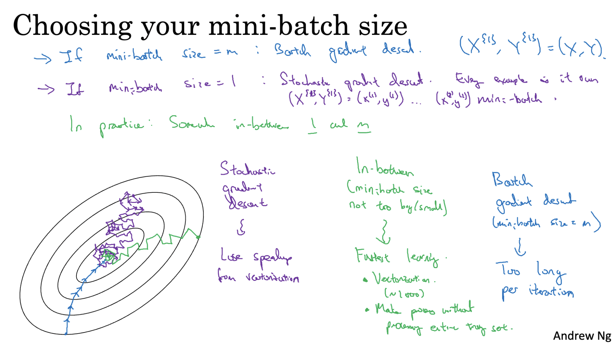

# Batch vs Mini Batch Gradient Descent
- Batch Gradient Descent computes the gradient using the entire training dataset before updating model parameters. While it's accurate, it can be computationally expensive and slow for large datasets.
- Mini-Batch Gradient Descent is an efficient optimization technique that divides the dataset into small batches, allowing the model to learn faster and make frequent updates.
- Mini-batches enable the use of vectorized operations, which significantly accelerate training and leverage parallel computation on GPUs.

### Processing Mini Batch
- The training data is divided into small batches of fixed size (e.g., 32, 64, 128, 256, 512)
- Each mini-batch is used to:
  - Compute forward propagation
  - Calculate the loss
  - Perform backpropagation
  - Update parameters using gradients

- Steps are repeated for every mini-batch in an epoch, allowing more frequent updates.

### Choosing Mini Batch Size
- Typical Mini Batch sizes are in 2 power range like 64, 128, 256, 512.
- Types of Gradient Descent by Mini-Batch Size
  - If m = total training set, then it is normal batch gradient descent. It is slow but stable.
  - If m = 1, then it is Stochastic Gradient Descent (SGD). It is fast but noisy.
  - If 1 < m < total size, then it is mini batch gradient descent. It is both fast and stable and it is widely used.

---

