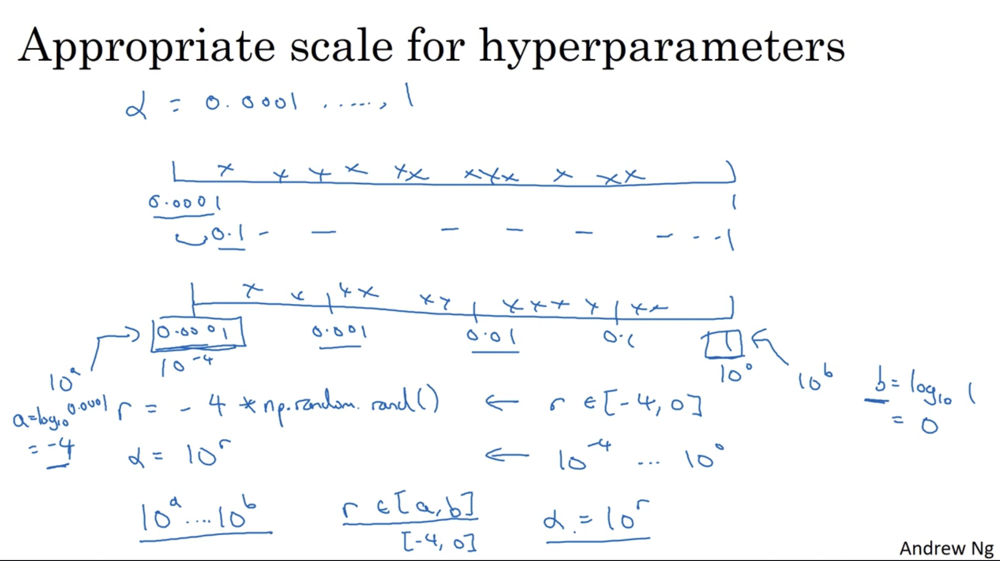
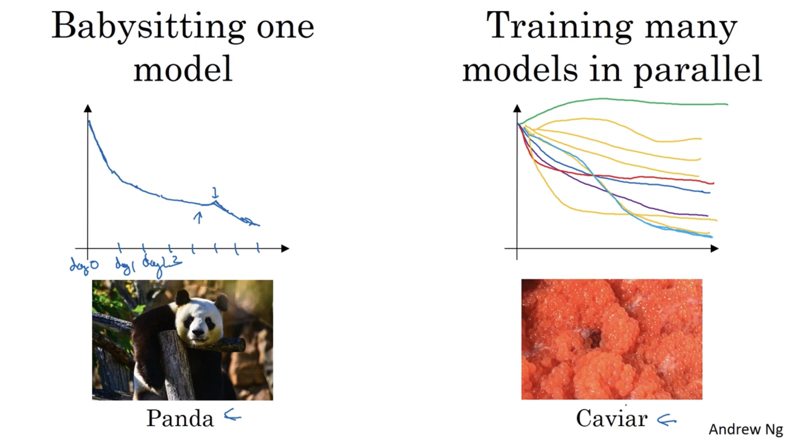
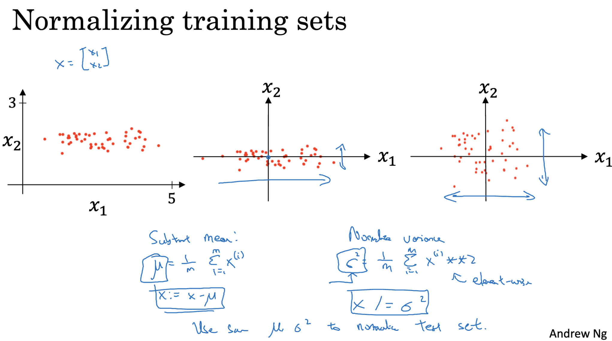
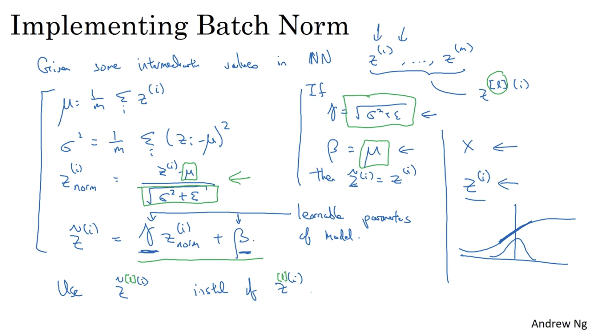

# Hyperparameters
Hyperparameters are configuration settings that guide both the training process and the architecture of a neural network. Unlike model parameters (such as weights `w` and biases `b`), they are not learned from the training data — instead, they are chosen beforehand and can be tuned to improve performance.

They influence how the model’s parameters are updated during training. Among them, the learning rate is often considered the most critical, as it controls how fast the network adapts to the data.

Other important hyperparameters include:
- Momentum term – helps accelerate training and reduce oscillations.
- Mini-batch size – determines the number of examples processed before each parameter update.
- Regularization parameters – such as L2 penalty or dropout rate to prevent overfitting.
- Network architecture choices – number of hidden layers, number of neurons per layer.
- Activation function selection – e.g., ReLU, sigmoid, tanh, etc.

## Tuning Process
In earlier machine learning workflows, a common approach to hyperparameter tuning was grid search — selecting evenly spaced points in the parameter space and testing each combination. While this method works for a small number of hyperparameters, it becomes inefficient as their number grows.

## Random Sampling
Rather than testing points on a fixed grid, random sampling picks values from the parameter space at random. This often covers more possibilities and is more efficient, especially when it’s unclear which hyperparameters will have the greatest impact.

## Coarse-to-Fine Search
Begin with a broad exploration across a wide range of values, identify promising regions, and then refine the search by testing more values in that smaller range.

By systematically exploring hyperparameter settings in this way, we can discover the combination that best optimizes the network’s performance.

## Using the Right Scale for Hyperparameters
Choosing the correct scale for hyperparameters is crucial, as it can significantly influence the training process and final performance of a model.

- For hyperparameters with a narrow range (e.g., number of hidden units: 50–100, number of layers: 2–4), uniform scaling works well — each value within the range is equally likely to be selected.
- For hyperparameters with a wide range (e.g., learning rate α, exponential decay rates β), uniform scaling is inefficient because it tends to over-sample certain regions while ignoring others. In these cases, logarithmic scaling is more effective.

Example:

If α ranges from 0.0001 to 1, uniform sampling would concentrate most values between 0.1 and 1, skipping much of the lower end.
With logarithmic scaling, you sample more evenly across magnitudes:

R = -4 * np.random.rand()  # Random number between -4 and 0
α = 10 ** R                # Learning rate between 10^-4 and 1

This approach ensures finer sampling near extreme values (especially close to 1), where small changes can have a big impact.

## Approaches to Hyperparameter Tuning

1. Babysitting Approach
Train a single model at a time, adjust the hyperparameters, and closely monitor performance after each run.
  - Best suited for scenarios with limited computational resources.
  - Allows for careful observation and manual fine-tuning.

2. Parallel Training
Train multiple models simultaneously, each with different hyperparameter settings, and compare their results to identify the best configuration.
  - Suitable when ample computational resources are available.
  - Speeds up the search process and is useful for large-scale tuning.

# Batch Normalization
When training a neural network, normalizing input features (subtracting the mean and dividing by the standard deviation) helps speed up learning and improve training stability. Batch Normalization extends this concept to hidden layers — adjusting their activations so that they maintain a controlled mean and variance during training.

### How it works (per mini-batch):

1. Compute Mean
- For all activations Z in a given layer, calculate the mean across the mini-batch.
2. Compute Variance
- Calculate the variance of these activations to measure how much they deviate from the mean.
3. Normalize Activations
- Subtract the mean from each activation (centering them around zero).
- Divide by the standard deviation (√variance + small constant ε for numerical stability) so they have unit variance.
4. Scale and Shift 
- Multiply by a learnable parameter γ (gamma) to control the spread of the activations.
- Add a learnable parameter β (beta) to shift the mean as needed.

This process helps stabilize and accelerate training, reduces sensitivity to weight initialization, and can even have a regularizing effect.

