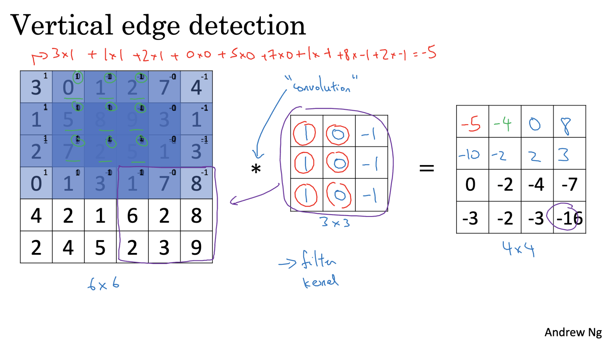
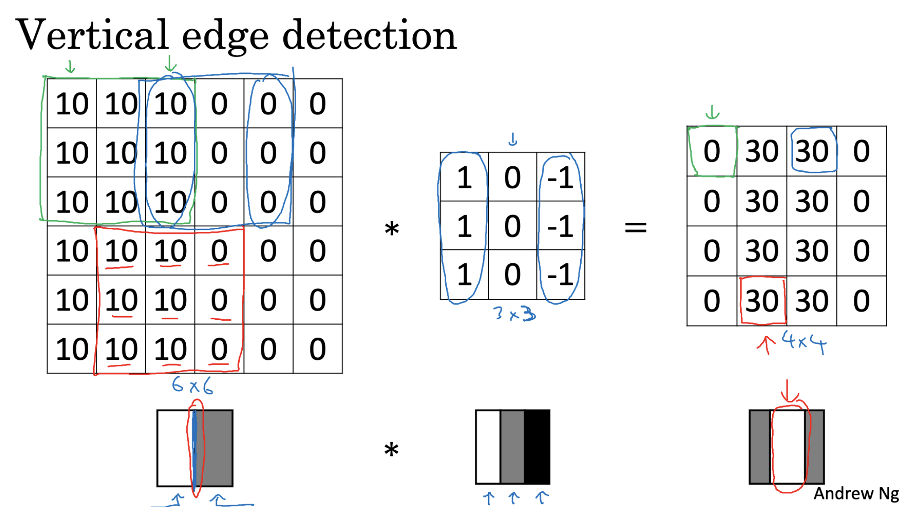

# Convolution in CNNs

**Concept:**  
In Convolutional Neural Networks, *convolution* is the process of applying a small matrix (filter or kernel) across an image to detect specific patterns. Each filter is designed to respond strongly to certain features — for example, vertical or horizontal edges, textures, or patterns.

**Feature Hierarchy:**  
- **Early layers:** Detect simple patterns like straight edges or color contrasts.  
- **Deeper layers:** Combine simpler patterns into more complex features, like shapes or object parts.  

**Example:**  
Imagine a **6×6 grayscale image** (one channel). To detect vertical edges, you could design a **3×3 filter** such as: 

`1  0 -1`

`1  0 -1`

`1  0 -1`

**Convolution Steps:**  
1. **Filter Placement:** Start with the filter aligned to the top-left of the image.  
2. **Multiply & Sum:** For each position, multiply the filter’s values with the overlapping image values, then sum them to get one output value.  
3. **Slide the Filter:** Move it horizontally by 1 pixel, repeat, then move down one row and continue.  
4. **Output Matrix:** Store each sum in a new output grid.  

**Output Shape Example:**  
- For a 6×6 input and 3×3 filter, without padding and with a stride of 1, the output will be **4×4**.  
- Positive and negative values in the output indicate the presence and orientation of edges.

## Edge Detection in CNNs

**Concept:**  
Edge detection is a fundamental step in understanding the structure of an image. It aims to identify boundaries between different regions, which can help in recognizing shapes, textures, and objects.

**Role in CNNs:**  
- Typically occurs in the **early layers** of a CNN.  
- Detects simple features such as **vertical** or **horizontal** edges.  
- Provides the foundation for detecting more complex features in deeper layers.

**Example - Vertical Edge Detection:**  
- A vertical edge filter might have values that respond strongly to changes in pixel intensity from left to right.  
- Applying such a filter to an image highlights vertical boundaries.

**Learning Filters with Backpropagation:**  
- Instead of manually designing filters, CNNs **learn filters from data**.  
- Filter weights (parameters) are adjusted during training using **backpropagation**.  
- This allows the network to detect not only vertical and horizontal edges, but also:  
  - Edges at various angles  
  - Complex textures  
  - Detailed patterns relevant to the task

## Padding in Convolutional Neural Networks (CNNs)

**Concept:**  
Padding is the process of adding extra pixels around the border of an image before applying convolution. It helps preserve the spatial dimensions of the input and reduces information loss from the edges.

**Problems Without Padding:**

1. **Image Shrinkage:**  
   - Example: Convolving a **6×6** image with a **3×3** filter produces a **4×4** output.  
   - Reason: The filter can only be placed in positions where it fully fits inside the image.  
   - Formula (no padding):  
     \[
     \text{Output size} = (n - f + 1) \times (n - f + 1)
     \]  
     where:
       - \(n\) = input size  
       - \(f\) = filter size  

2. **Loss of Edge Information:**  
   - Edge and corner pixels appear in fewer receptive fields during convolution.  
   - Central pixels are used in more filter regions, giving them more influence.  
   - This causes important boundary details to be lost.

**Padding Solution:**  
- Add extra pixels (often zeros) around the image border before convolution.  
- Benefits:  
  - Preserves the original input size after convolution.  
  - Ensures that edge pixels contribute equally to the output.

**General Formula (with padding \(p\)):**  
\[
\text{Output size} = (n + 2p - f + 1) \times (n + 2p - f + 1)
\]  
where:
- \(p\) = number of padding pixels on each side  

